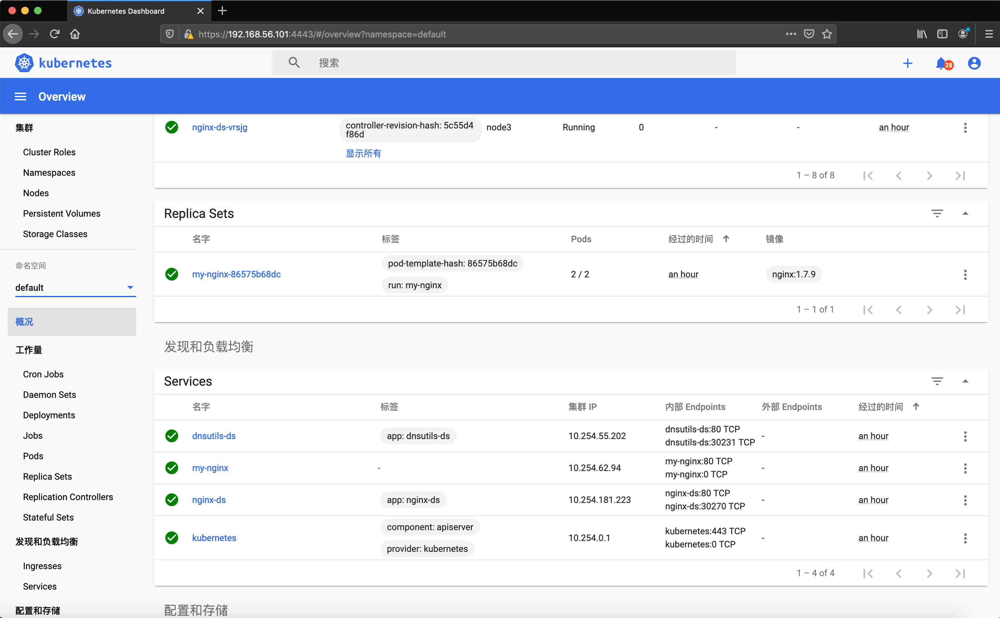
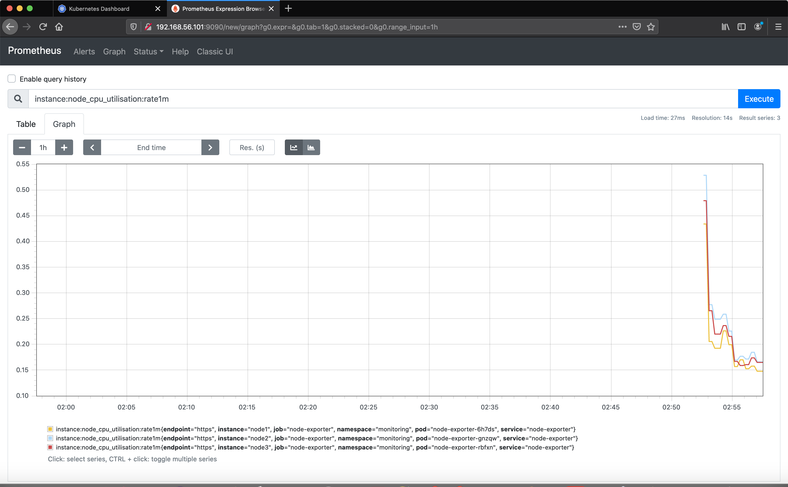
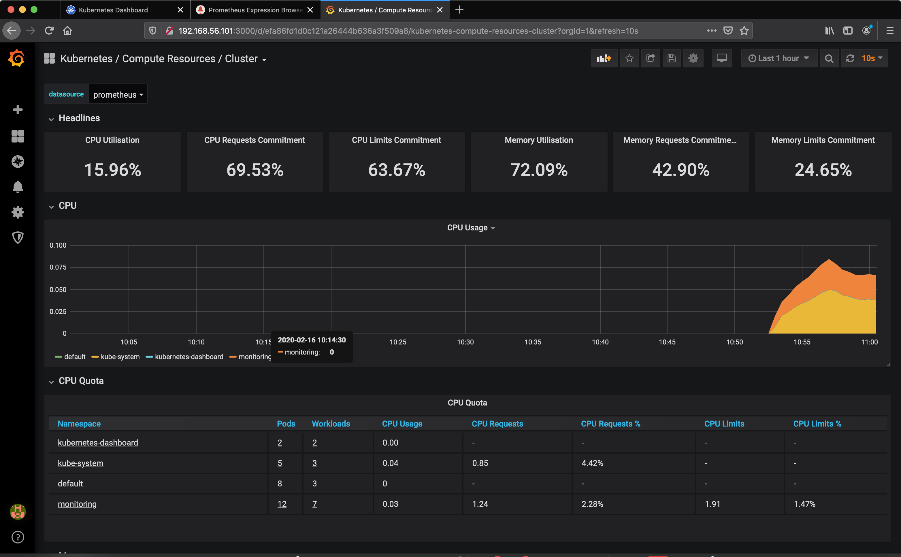

# 使用Vagrant和VirtualBox在本地搭建分布式的Kubernetes集群

当我们需要在本地开发时，希望能够有一个开箱即用又可以方便定制的分布式开发环境，这样才能对Kubernetes本身和应用进行更好的测试。现在我们使用[Vagrant](https://www.vagrantup.com/)和[VirtualBox](https://www.virtualbox.org/wiki/Downloads)来创建一个这样的环境。

Kubernetes Cluster搭建的过程，可以参考[和我一步步部署 kubernetes 集群](https://github.com/opsnull/follow-me-install-kubernetes-cluster)

## 准备环境

需要准备以下软件和环境：

- 8G以上内存
- Vagrant 2.2.4
- VirtualBox 5.2.36
- Mac / Linux
- 虚拟机：Centos 7

## 集群准备

我们使用Vagrant和Virtualbox安装包含3个节点的kubernetes集群。

| IP           | 主机名   | 组件                                       |
| ------------ | ----- | ---------------------------------------- |
| 192.168.56.101 | node1 | kube-apiserver、kube-controller-manager、kube-scheduler、kubelet、etcd、corecdn、dashboard |
| 192.168.56.102 | node2 | kube-apiserver、kube-controller-manager、kube-scheduler、kubelet、etcd |
| 192.168.56.103 | node3 | kube-apiserver、kube-controller-manager、kube-scheduler、kubelet、etcd |

**注意**：以上的IP、主机名和组件都是固定在这些节点的，即使销毁后下次使用vagrant重建依然保持不变。

容器IP范围：172.30.0.0/16

Kubernetes service IP范围：10.254.0.0/16

## 主要组件版本

| 组件 | 版本 |
| --- | --- |
| kubernetes | 1.14.8 |
| etcd | 3.3.13 |
| Flanneld| 0.11.0 |
| Docker | 18.09.6-ce |

### 插件
- Coredns
- Dashboard
- Prometheus
- ELK (elasticsearch、fluentd、kibana)

## 运行结果展示

### Kubernetes DashBoard

### Prometheus

### Grafana
